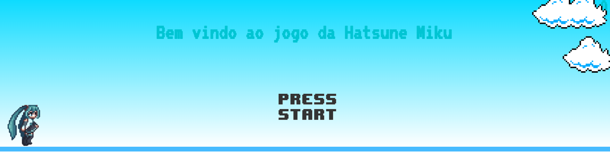
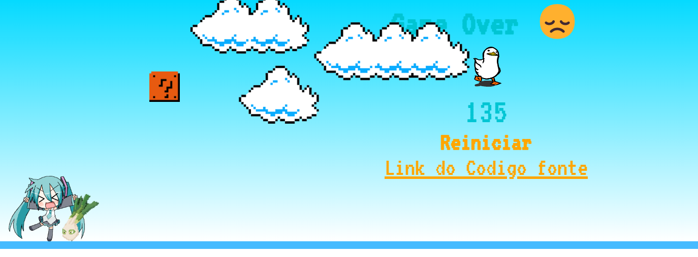

# minigame Hatsune Miku

Esse jogo tem como objetivo possibilitar que os usuarios que navegam na web se dirvitam com o jogo da Miku!!

Para jogar <a href="https://rafa-sm.github.io/jogo-do-miku/">Clique aqui!!</a>

## Tecnologias usadas: 
<ul>
   <li>JavaScript</li>
   <li>CSS3</li> 
   <li>HTML5</li> 
</ul>

## Apresentação:
 
### Tela Inicial: 

### Tela de GameOver:

